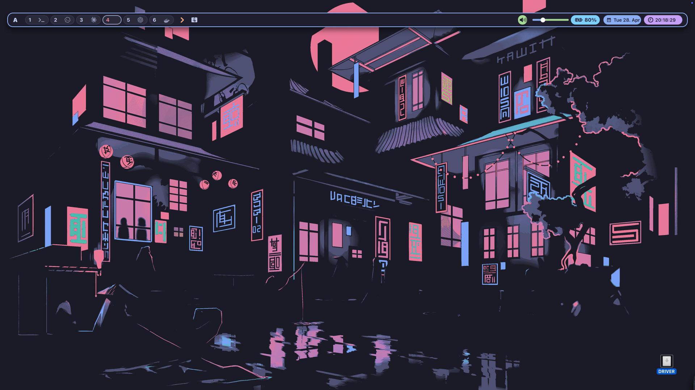
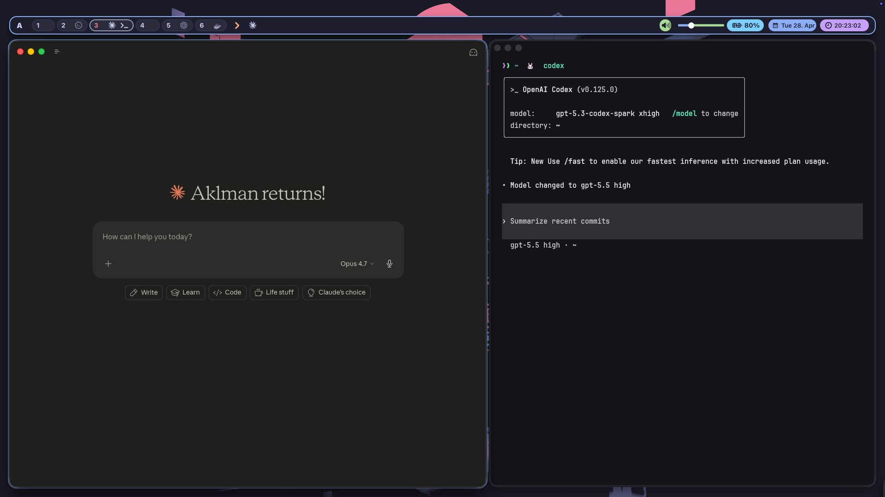
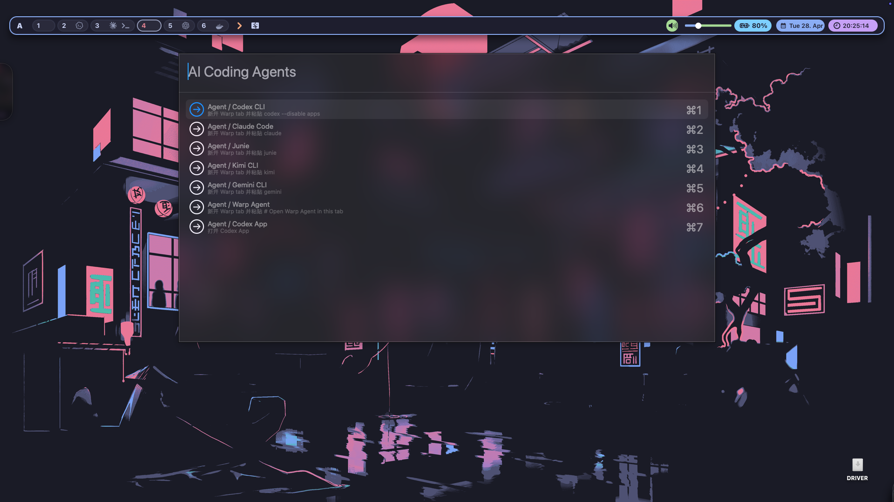
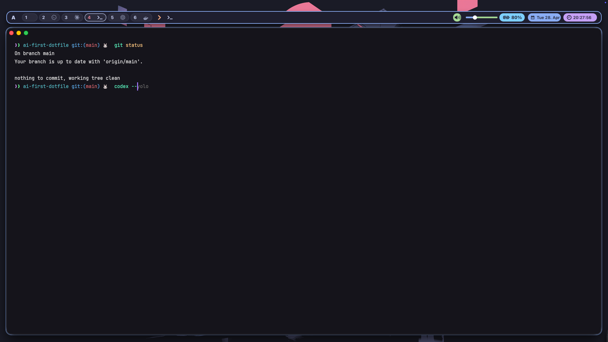
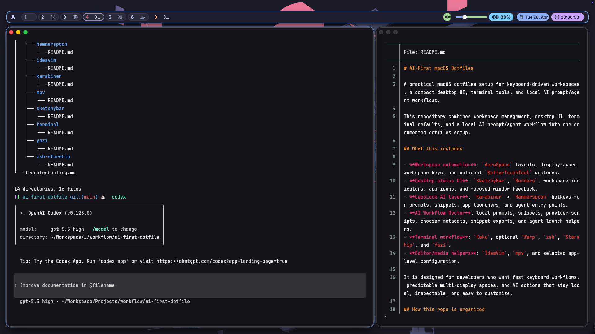
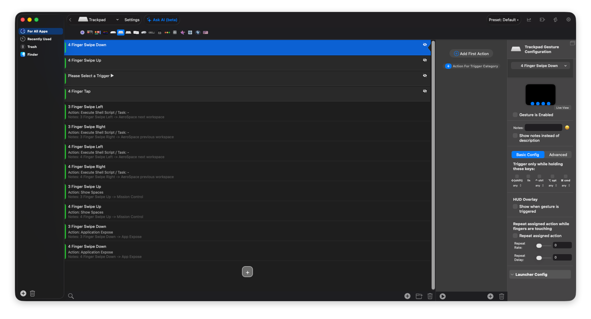
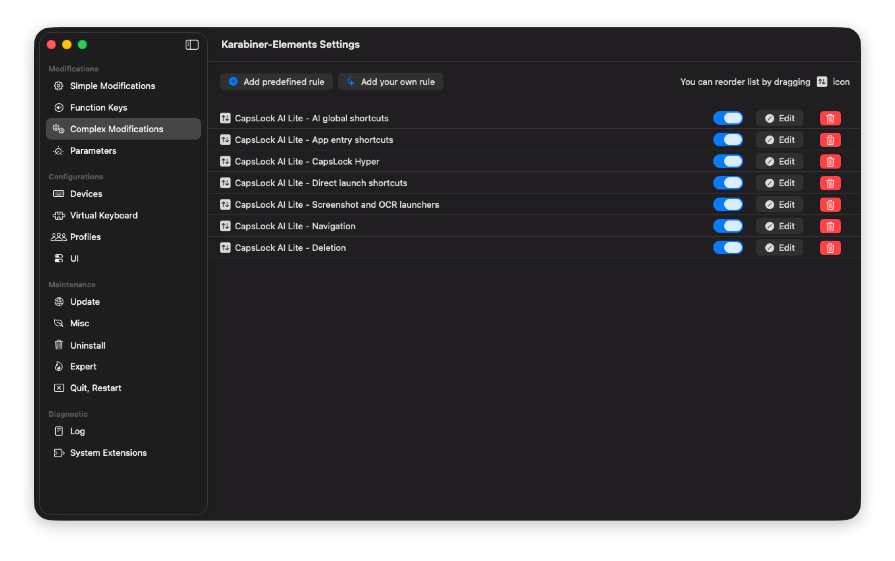

# Screenshots

This repository includes public screenshots that show the main desktop, workspace, terminal, and AI workflow surfaces.

## Purpose

Screenshots help new users verify:

- workspace layout behavior
- desktop status bar and borders
- prompt and chooser UX
- AI Router exports/import flows

## Included screenshot set

Use public demo windows and avoid any real names, project paths, logs, tickets, or emails.

| File | Purpose | Referenced from |
|---|---|---|
| [`desktop-overview.png`](../assets/screenshots/desktop-overview.png) | Full desktop with workspace bar and app layout. | `README.md` |
| [`sketchybar-workspace-bar.png`](../assets/screenshots/sketchybar-workspace-bar.png) | Top bar showing workspace indicators and app icons. | `docs/tools/sketchybar/README.md` |
| [`aerospace-tiling-layout.png`](../assets/screenshots/aerospace-tiling-layout.png) | Multi-window AeroSpace tiling with workspace layout. | `docs/tools/aerospace/README.md` |
| [`capslock-chooser.png`](../assets/screenshots/capslock-chooser.png) | AI Router prompt chooser. | `README.md`, `docs/tools/ai-router/README.md` |
| [`agent-chooser.png`](../assets/screenshots/agent-chooser.png) | Long-running coding agent chooser. | `docs/tools/hammerspoon/README.md` |
| [`starship-prompt.png`](../assets/screenshots/starship-prompt.png) | Shell prompt with path and git context. | `docs/tools/zsh-starship/README.md` |
| [`kaku-warp-terminal.png`](../assets/screenshots/kaku-warp-terminal.png) | Terminal workflow with Kaku/Warp-oriented configuration. | `docs/tools/terminal/README.md` |
| [`raycast-import.png`](../assets/screenshots/raycast-import.png) | Raycast snippet import flow for AI Router exports. | `docs/tools/ai-router/README.md` |
| [`bettertouchtool-gestures.png`](../assets/screenshots/bettertouchtool-gestures.png) | Trackpad gesture configuration for workspace movement. | `docs/tools/bettertouchtool/README.md` |
| [`karabiner-profile.png`](../assets/screenshots/karabiner-profile.png) | `CapsLock AI Lite` Karabiner profile. | `docs/tools/karabiner/README.md` |

## Gallery

### Desktop overview

### SketchyBar workspace bar

### AeroSpace tiling layout

### AI Router chooser

### Coding agent chooser

### Starship prompt

### Terminal workflow

### Raycast snippet import

### BetterTouchTool gestures

### Karabiner profile

## Screenshot sanitization rules

When you create screenshots for this repository:

- Remove real chats, URLs, project names, ticket IDs, and client/company identifiers.
- Do not capture notifications with personally identifying accounts or messages.
- Do not include secrets, API keys, token values, cookies, `.bash_history`, shell history, or browser login hints.
- Use demo project names such as `demo-workspace`, `sample-repo`, and placeholder text.
- Avoid capturing machine hostnames if they reveal an internal domain.

If a file currently contains sensitive content:

- regenerate with demo content
- crop and blur all sensitive regions
- or replace with a `TODO:` placeholder entry instead of uploading.

## Asset placement

- `assets/screenshots/README.md`
- `assets/screenshots/*.png`
