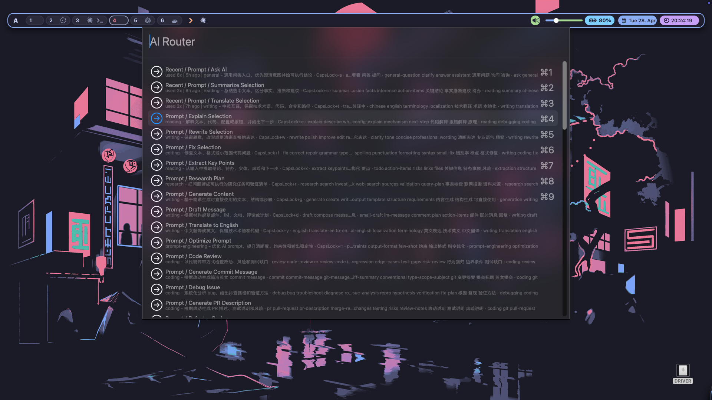
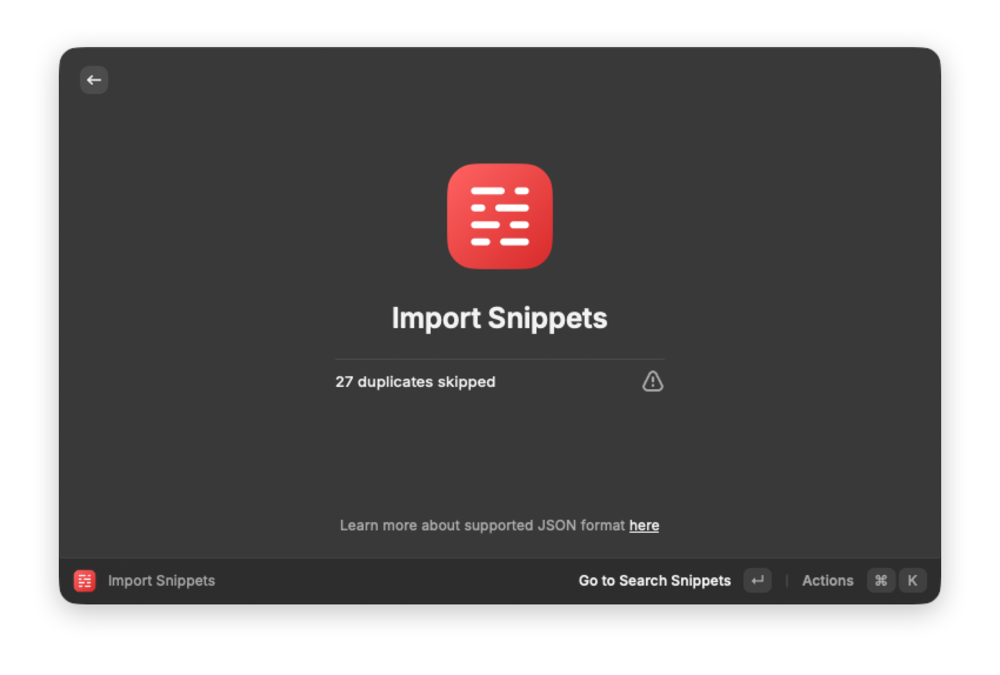

# AI Workflow Router

`AI Router` standardizes prompt rendering, snippet generation, agent selection, and provider execution.
It is the central automation service used by the CapsLock AI workflow.



## Installed files

- `home/.config/ai-router/ai-router.sh`
- `home/.config/ai-router/config.json`
- `home/.config/ai-router/lib/router_tools.py`
- `home/.config/ai-router/prompts/`
- `home/.config/ai-router/snippets/`
- `home/.config/ai-router/providers/`
- `home/.config/ai-router/README.md` (reference notes)
- `bootstrap/install/ai-router.sh`

## Install

```bash
./bootstrap/install/ai-router.sh
```

This will deploy files, make scripts executable, build indices, and export snippets.

## Core concepts

- **Prompt**: Markdown template with frontmatter + variables (e.g. `{{selection}}`).
- **Snippet**: Small reusable text blocks for repeated insertion patterns.
- **Provider**: Back-end executor (`kimi`, `gemini`, etc.).
- **Agent**: Long-running command executors (`codex`, `claude`, `junie`, etc.).
- **Skill/Tool/Plugin**: Optional UI or operational entries shown in chooser modes.

## How to use

### Render a prompt

```bash
~/.config/ai-router/ai-router.sh render summarize
```

### Run a prompt directly

```bash
~/.config/ai-router/ai-router.sh run summarize
```

### Open chooser

```bash
~/.config/ai-router/ai-router.sh palette
~/.config/ai-router/ai-router.sh agent-menu
```

### Manage favorites

```bash
~/.config/ai-router/ai-router.sh favorite list
~/.config/ai-router/ai-router.sh favorite add prompt summarize "Summarize Selection"
```

## How AI Router + Hammerspoon connect

1. Karabiner sends CapsLock-based chords.
2. Hammerspoon receives the chord and dispatches router actions.
3. Router reads catalog/config and renders/executes the matching item.
4. Output is copied, launched, or opened according to command action.

## Why no hidden provider hotkeys?

Provider execution is kept explicit to avoid accidental external calls and tokenless surprise actions.
The default flow favors explicit invocation:

- choose intent (prompt/agent)
- review generated output/command
- execute intentionally

## Adding content

### New prompt

1. Add file to `home/.config/ai-router/prompts/` with YAML frontmatter.
2. Rebuild index:

```bash
~/.config/ai-router/ai-router.sh index
```

### New snippet

1. Add file to `home/.config/ai-router/snippets/`.
2. Add any aliases/keywords metadata.
3. Re-export:

```bash
~/.config/ai-router/ai-router.sh export-snippets all
```

### New provider

1. Add executable in `home/.config/ai-router/providers/`.
2. Update `home/.config/ai-router/config.json`.
3. Rebuild index and verify chooser inputs:

```bash
~/.config/ai-router/ai-router.sh index
~/.config/ai-router/ai-router.sh list providers
```

## Export and external tools

```bash
~/.config/ai-router/ai-router.sh export-snippets all
```

Expected export artifacts:

- `exports/raycast-snippets.json`
- `exports/ai-router-snippets.json`

Use Raycast import/imported JSON as a runtime workflow bridge.



## Safety and privacy

- Keep provider binary names explicit and local.
- `catalogs/`, `cache/`, `state/`, and `logs/` are runtime outputs and excluded from tracked repo state.
- Real API keys stay outside the repo and loaded from private local files only.
