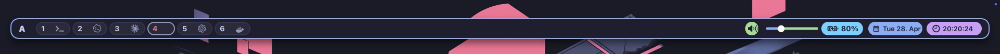

# SketchyBar and Borders

`SketchyBar` plus `Borders` is the lightweight desktop UI layer for the AI-first workflow.



## Installed files

- `home/.config/sketchybar/`
- `home/.config/borders/`
- `bootstrap/install/sketchybar.sh`
- `bootstrap/install/borders.sh`

## What is included

- Left/center/right bar sections configured by `home/.config/sketchybar/sketchybarrc`.
- Visual themes and runtime helper scripts in `home/.config/sketchybar/` and `home/.config/borders/bordersrc`.
- AeroSpace workspace integration via plugin callbacks.
- AI attention indicators for selected tools and IDEs.
- `Option + Shift + Space` hides/shows SketchyBar through AeroSpace and also updates the AeroSpace top gap so windows reclaim or release the bar area.
- Optional font fetch for the bar icon font and symbols.
- SbarLua is installed from a pinned upstream commit by `bootstrap/install/sketchybar.sh`; override `SBARLUA_REF` only when intentionally upgrading.

## Install and refresh

```bash
./bootstrap/install/sketchybar.sh
./bootstrap/install/borders.sh
brew services restart sketchybar
brew services restart borders
```

## Core behavior

- No user session state is tracked in this repo.
- SketchyBar plugin cache/sockets are runtime-only and recreated per machine.
- AI attention runtime state is stored in `~/Library/Caches/sketchybar/ai_attention.json`.
- Border style is reproducible from `bordersrc` and can be adjusted safely.

## AI Attention Notifications

The bar can show lightweight attention badges for:

- Warp
- Codex
- IntelliJ IDEA
- GoLand

The implementation is split deliberately:

- `home/.config/sketchybar/items/ai_notifications.sh` defines the hidden sync item, visible badges, popup rows, and click actions.
- `home/.config/sketchybar/plugins/ai_app_notifications.sh` reads macOS notification metadata, stores a local attention state, renders SketchyBar items, and reveals apps through AeroSpace.
- Hammerspoon does not read the macOS notification database. It only writes clear requests and asks SketchyBar to sync.

This avoids two common failure modes:

- SketchyBar hotload loops caused by writing runtime state under `~/.config/sketchybar`.
- Hammerspoon permission failures when trying to read macOS notification databases.

### Required macOS permission

To read notification metadata, SketchyBar needs Full Disk Access:

1. Open **System Settings -> Privacy & Security -> Full Disk Access**.
2. Add `/opt/homebrew/bin/sketchybar` or the resolved SketchyBar binary.
3. Restart SketchyBar:

```bash
brew services restart sketchybar
```

macOS does not allow this permission to be granted silently from an install script.

## Privacy notes

- `home/.config/sketchybar` does not include private account/session data.
- Runtime art assets and media cover fetches are not committed.
- Notification attention state is runtime-only and kept outside this repo.
- `BORDER` and bar configuration only references local paths and public binaries.
